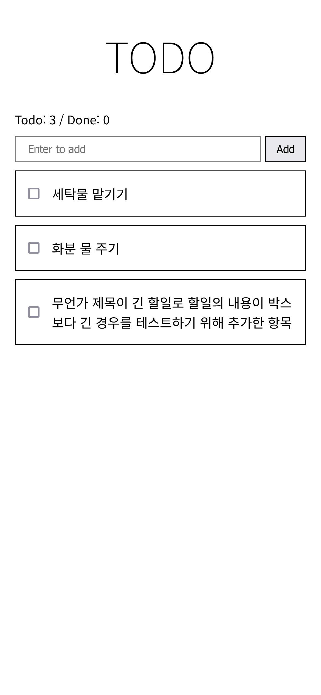

# Leptos-Todo
A TODO web app built on [leptos](https://github.com/leptos-rs/leptos/), a frontend framework written in pure rust.  
Most of the implementation referred
[the TodoMVC example](https://github.com/leptos-rs/leptos/tree/main/examples/todomvc)
on leptos github, though some designs are original.

Filtering and deleting items is not available yet.

## Reference
- [Leptos API Reference](https://docs.rs/leptos/latest/leptos/index.html)
- [leptos/examples/todomvc](https://github.com/leptos-rs/leptos/tree/main/examples/todomvc)
- [Leptos the book](https://leptos-rs.github.io/leptos/)
- [MDN web docs](https://developer.mozilla.org/) (for keyboard events)
- [HEROPY Tech blog](https://heropy.blog/2018/11/24/css-flexible-box/) (for CSS Flex)

## Screenshot

